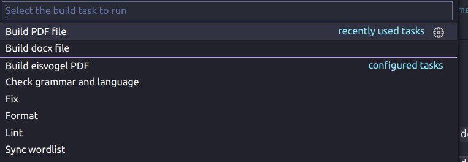

# Typo 📝

> So you want to use the simplicity of markdown, but not give up the power of
> latex? Well, with this template you can use both and stay flexible 🚀

**Features:**

- [x] Continuous integration:
  - _Build whole document using latex_
  - _Check Grammar and spelling_
  - _Lint markdown, latex,.... files_
- [x] Continuous delivery: _Save generated PDF as artifact_
- [x] Use _markdown_ as lightweight markup language
- [x] Use _latex_ for the document preparation, Math formulas,...
- [x] Use _citations_ easily

---

## Requirements

> Please make sure to have at least the required tools set up before starting 😄

1. **Required**:
   - [Pandoc](https://pandoc.org/) to convert markdown to PDF using latex
   - [Latex](https://www.latex-project.org/)
   - [Bibtex](http://www.bibtex.org/)
   - [Make](https://www.gnu.org/software/make/manual/make.html)
2. _Optional_:
   > The following tools are not really needed to build the document. Nevertheless, they help with linting, fixing,...
   - [The Pandoc Eisvogel template](https://github.com/Wandmalfarbe/pandoc-latex-template/): Awesome latex/markdown template
   - [TeXtidote](https://github.com/sylvainhalle/textidote): Latex/Markdown cli language/spell checker
   - [Prettier](https://prettier.io/): Format and prettify your documents
   - [Markdownlint](https://github.com/igorshubovych/markdownlint-cli): Check/Fix your markdown files

## Get started

1. Click the green `Use this template` button top right corner
2. Now you're ready to go 🚀: Just write your content using markdown and include you references or use latex as described below.

## How it works

> Fun fact: The documentation of this template already uses it's features 🔄 .
> You can use it as example 😄

- You can use most of the features mentioned below with simple `make` commands.
  Check out the next sections for details.

1. You can organize your documents in folders 📙: [How to use folders](./docs/folders.md)
2. You can use citations to use references 📖: [How to use citations](./docs/citations.md)
3. You can use latex in your markdown writing 👨‍🏫 : [How to use latex](./docs/latex.md)
4. You can customize the generated PDF document 💡: [How to customize your document](./docs/customization.md)
5. You can spell and grammar check your files 💬 : [How to check language](./docs/language.md)
6. The CI/CD pipelines run automatically when you push to github 🏗️: [How the CI/CD works](./docs/ci-cd.md)
7. And there is even more awesome tooling you can use to enhance your workflow 💅: [Even more tooling](./docs/tooling.md)

## Commands 🔧

> `make` is used for build automation. Refer to the [Makefile](./Makefile)

1. Generate PDF: `make`
2. Generate docx: `make docx`

The next recipes make use of the _optional_ dependencies:

<!-- markdownlint-disable MD029 -->
3. Generate PDF using the eisvogel 🐦 template: `make eisvogel`
4. Lint markdown files: `make lint`
5. Automatically try to fix markdown files: `make fix`
6. Try to format markdown files automatically: `make format`
7. Check language and grammar: `make check-lang`
8. Sync wordlist(See next chapter for details): `make sync-wl`
9. Convert svg files to pdf f.ex for the cover(Needs `Inkscape` installed): `make svg-to-pdf`
<!-- markdownlint-enable MD029 -->

### Using VScode

> If you use VScode, you can run the commands above using VScode `tasks`

Run the `Run Task` command or simply hit `Ctrl/Cmd + F9`:

## Development/Contributing 👨‍💻

1. Please request changes in the [issue tracker](https://github.com/daniel-vera-g/typo/issues) after that, you can open a PR :-)
2. See the section about CI/CD. The Pipelines should work.

## TODO 🏁

> See: [Issues](https://github.com/daniel-vera-g/typo/issues/)

## Acknowledgement

- [TeXtidote](https://github.com/sylvainhalle/textidote): Latex/Markdown cli language/spell checker
- [The Pandoc Eisvogel template](https://github.com/Wandmalfarbe/pandoc-latex-template/): Awesome latex/markdown template
